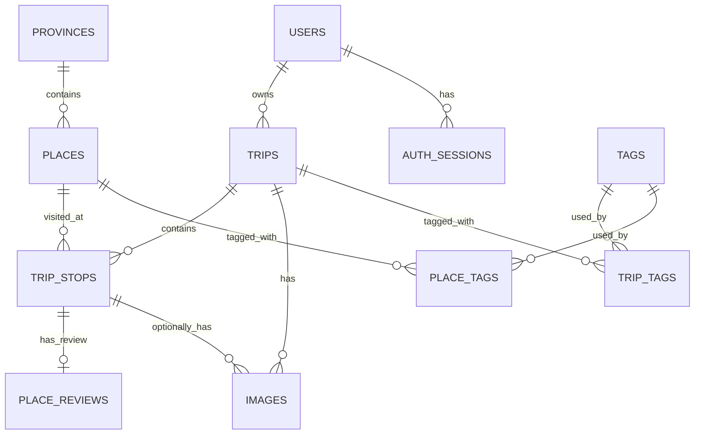

# AGENTS-BACKEND.md

## Project

**Name:** Nomad Diary API  
**Type:** Backend API for a personal travel diary

Nomad Diary stores trips, reusable places, trip stops, provinces, reviews, images, tags, map data, and statistics.

Build the backend as a **modular monolith**. Do not introduce microservices for the MVP.

Recommended stack:

```text
Node.js
Express.js
PostgreSQL
JWT or session authentication
S3-compatible storage or Cloudinary
```

Use JavaScript unless TypeScript is explicitly requested.

---

## Core Domain

```text
User
├── Auth Sessions
└── Trips
    ├── Trip Stops
    │   ├── Place
    │   │   └── Province
    │   ├── Place Review
    │   └── Images
    ├── Images
    └── Tags
```

### Important distinction

```text
Place      = reusable physical location
Trip Stop  = one visit to that place during one trip
```

A place should not be duplicated each time it is visited.

A trip may visit the same place more than once. Never add a unique constraint on:

```text
(trip_id, place_id)
```

---

## Database

```text
Engine: PostgreSQL
Database: nomad_diary
Schema: nomad_diary
```

Main tables:

```text
users
auth_sessions
provinces
places
trips
trip_stops
place_reviews
images
tags
trip_tags
place_tags
```

### Relationships



---

## Business Rules

### Users

- Email must be unique among active users.
- Username must be unique among active users.
- Password hashes must never be returned by the API.
- Every private-resource query must filter by the authenticated user.

### Auth Sessions

- One user may have multiple sessions for different devices.
- Store only a SHA-256 refresh-token hash; never store or log the raw refresh token.
- A session is active only when `revoked_at IS NULL` and `expires_at > now()`.
- Refresh-token rotation must revoke the old session and create the replacement in one transaction.
- Logout revokes the current session; password changes and account deletion revoke all sessions for the user.
- Hard-deleting a user cascades to `auth_sessions`.

### Trips

Trip status values:

```text
0 = draft
1 = planned
2 = ongoing
3 = completed
4 = cancelled
```

Rules:

- A trip belongs to one user.
- A trip slug is unique per active user.
- `end_date` cannot be before `start_date`.
- Soft-deleted trips must not appear in normal queries.

### Places

- A place is reusable across trips.
- A place belongs to one province.
- Latitude must be between `-90` and `90`.
- Longitude must be between `-180` and `180`.
- Do not copy place fields into `trip_stops`.

### Trip Stops

- A trip stop belongs to one trip and one place.
- `visit_order` must be greater than zero.
- Active `visit_order` values must be unique within a trip.
- The same place may occur multiple times in one trip.
- `departed_at` cannot be before `arrived_at`.

### Reviews

Revisit status:

```text
0 = not reviewed
1 = recommended
2 = consider
3 = not recommended
```

Rules:

- One active review per trip stop.
- Rating may be null or from 1 to 5.
- A review belongs to a specific visit.
- Do not write the latest review into `places`.
- Planning warnings use the latest active review.
- Warnings must not block the user from adding a place.

### Images

```text
trip_id       required
trip_stop_id  optional
```

Rules:

- Every image belongs to a trip.
- An image may belong to a specific trip stop.
- When `trip_stop_id` is present, that stop must belong to the same trip.
- Do not duplicate `place_id` or `province_id` in `images`.
- Derive place and province through joins.
- Only one active cover image is allowed per trip.

### Soft Delete

Main tables use:

```sql
is_deleted boolean NOT NULL DEFAULT false
```

Normal queries must include:

```sql
is_deleted = false
```

Do not physically delete records unless cleanup is explicitly required.

`auth_sessions` does not use soft delete. Session lifecycle is represented by
`expires_at` and `revoked_at`; expired/revoked sessions may be removed by an
explicit cleanup job.

---

## Authentication APIs

```text
POST   /api/auth/register
POST   /api/auth/login
POST   /api/auth/logout
POST   /api/auth/refresh-token
GET    /api/auth/me
PATCH  /api/auth/me
PATCH  /api/auth/change-password
DELETE /api/auth/account
```

Rules:

- Hash passwords with bcrypt or argon2.
- Never log raw passwords.
- Never return `password_hash`.
- Never return `refresh_token_hash`.
- Store only refresh-token hashes in `auth_sessions`.
- Revoke/rotate auth sessions transactionally.
- Authenticate every private endpoint.
- Store secrets in environment variables.

---

## Trips APIs

```text
GET    /api/trips
POST   /api/trips
GET    /api/trips/:id
PATCH  /api/trips/:id
DELETE /api/trips/:id
PATCH  /api/trips/:id/publish
PATCH  /api/trips/:id/unpublish
PATCH  /api/trips/:id/cover
```

Supported list filters:

```text
status
year
search
page
pageSize
sort
```

Create body example:

```json
{
  "title": "Đà Lạt 2026",
  "slug": "da-lat-2026",
  "description": "Chuyến đi 4 ngày 3 đêm",
  "status": 1,
  "startDate": "2026-07-20",
  "endDate": "2026-07-24",
  "isPublic": false
}
```

Only return trips owned by the authenticated user unless a public-trip endpoint is explicitly implemented.

---

## Trip Stops APIs

```text
GET    /api/trips/:tripId/stops
POST   /api/trips/:tripId/stops
PATCH  /api/trip-stops/:id
DELETE /api/trip-stops/:id
PATCH  /api/trips/:tripId/stops/reorder
```

Create body:

```json
{
  "placeId": 10,
  "visitOrder": 3,
  "arrivedAt": "2026-07-20T08:00:00+07:00",
  "departedAt": "2026-07-20T10:30:00+07:00",
  "title": "Buổi sáng ở hồ",
  "note": "Nên đến trước 7 giờ"
}
```

Reorder body:

```json
{
  "stops": [
    { "id": 12, "visitOrder": 1 },
    { "id": 15, "visitOrder": 2 }
  ]
}
```

Reordering must run in a database transaction.

---

## Places APIs

```text
GET    /api/places
POST   /api/places
GET    /api/places/:id
PATCH  /api/places/:id
DELETE /api/places/:id
GET    /api/places/search
GET    /api/places/:id/history
GET    /api/places/:id/planning-warning
```

Supported filters:

```text
q
provinceId
tagId
visited
favorite
revisitStatus
page
pageSize
```

Planning warning response example:

```json
{
  "placeId": 25,
  "visited": true,
  "visitCount": 2,
  "lastVisitedAt": "2026-05-14T08:30:00+07:00",
  "latestReview": {
    "rating": 2,
    "revisitStatus": 3,
    "isFavorite": false,
    "note": "Quá đông và khó gửi xe"
  },
  "warning": {
    "level": "danger",
    "message": "Bạn đã đánh dấu địa điểm này là không nên quay lại."
  }
}
```

---

## Provinces APIs

```text
GET /api/provinces
GET /api/provinces/:id
GET /api/provinces/:id/places
GET /api/provinces/visited
```

Visited province response example:

```json
{
  "id": 68,
  "code": "68",
  "name": "Lâm Đồng",
  "tripCount": 3,
  "placeCount": 8,
  "visitCount": 12,
  "lastVisitedAt": "2026-03-11T07:00:00+07:00"
}
```

The frontend matches:

```text
province.code
↕
GeoJSON feature.properties.code
```

---

## Reviews APIs

```text
GET    /api/trip-stops/:tripStopId/review
PUT    /api/trip-stops/:tripStopId/review
DELETE /api/trip-stops/:tripStopId/review
```

Review body:

```json
{
  "rating": 5,
  "revisitStatus": 1,
  "isFavorite": true,
  "note": "Rất đáng quay lại",
  "warningNote": null
}
```

Use `PUT` because there is one active review per trip stop.

---

## Images APIs

```text
GET    /api/images
POST   /api/images
GET    /api/images/:id
PATCH  /api/images/:id
DELETE /api/images/:id
```

Supported filters:

```text
tripId
tripStopId
placeId
provinceId
favorite
cover
from
to
page
pageSize
sort
```

Examples:

```text
GET /api/images?tripId=5
GET /api/images?placeId=8
GET /api/images?provinceId=68
GET /api/images?favorite=true
```

Query paths:

```text
By trip:
images.trip_id
```

```text
By place:
images → trip_stops → places
```

```text
By province:
images → trip_stops → places → provinces
```

For large files, prefer:

```text
POST /api/uploads/presigned-url
POST /api/uploads/complete
```

---

## Tags APIs

```text
GET    /api/tags
POST   /api/tags
PATCH  /api/tags/:id
DELETE /api/tags/:id
POST   /api/trips/:id/tags
DELETE /api/trips/:id/tags/:tagId
POST   /api/places/:id/tags
DELETE /api/places/:id/tags/:tagId
```

Do not store comma-separated tags in a text column.

---

## Dashboard APIs

```text
GET /api/dashboard
GET /api/dashboard/recent-trips
GET /api/dashboard/most-visited
GET /api/dashboard/not-recommended
GET /api/dashboard/visited-provinces
```

Dashboard response example:

```json
{
  "tripCount": 16,
  "provinceCount": 28,
  "placeCount": 142,
  "visitCount": 195,
  "imageCount": 3260,
  "favoritePlaceCount": 14,
  "notRecommendedPlaceCount": 3
}
```

Important:

```text
placeCount = COUNT(DISTINCT trip_stops.place_id)
visitCount = COUNT(trip_stops.id)
```

---

## Statistics APIs

```text
GET /api/statistics/yearly
GET /api/statistics/monthly
GET /api/statistics/provinces
GET /api/statistics/places
GET /api/statistics/timeline
GET /api/statistics/heatmap
```

Supported statistics:

- Trips per year
- Trips per month
- Unique places visited
- Total visits
- Provinces visited
- First and latest visit per place
- Visit count per place
- Image count per trip, place, and province
- Favorite places
- Recommended, consider, and not-recommended places
- Average rating by place and province
- New places versus revisits

Do not claim support for expenses, transport, weather, companions, or accommodation unless additional tables exist.

---

## Map APIs

```text
GET /api/map/markers
GET /api/map/provinces
GET /api/map/places/:id
```

Marker response example:

```json
{
  "placeId": 25,
  "name": "Hồ Xuân Hương",
  "latitude": 11.9433,
  "longitude": 108.4453,
  "provinceId": 68,
  "provinceCode": "68",
  "visitCount": 2,
  "latestRating": 3,
  "latestRevisitStatus": 2
}
```

---

## Search API

```text
GET /api/search?q=Đà Lạt
```

Search categories:

```text
trips
places
provinces
tags
```

Use pagination or per-category limits.

---

## Response Format

Success:

```json
{
  "success": true,
  "data": {},
  "meta": {}
}
```

List:

```json
{
  "success": true,
  "data": [],
  "meta": {
    "page": 1,
    "pageSize": 20,
    "total": 125,
    "totalPages": 7
  }
}
```

Error:

```json
{
  "success": false,
  "error": {
    "code": "TRIP_NOT_FOUND",
    "message": "Trip not found",
    "details": null
  }
}
```

Never expose raw PostgreSQL errors to the client.

---

## HTTP Status Codes

```text
200 OK
201 Created
204 No Content
400 Bad Request
401 Unauthorized
403 Forbidden
404 Not Found
409 Conflict
422 Unprocessable Entity
500 Internal Server Error
```

Prefer `404` for private resources owned by another user to avoid leaking their existence.

---

## Validation

Validate:

- Route parameters
- Query parameters
- Request bodies
- Dates
- Coordinates
- Enum values
- Pagination
- Uploaded file metadata

Recommended libraries:

```text
Zod
Joi
express-validator
```

Do not rely only on database constraints.

---

## Security Rules

- Always use parameterized SQL.
- Never concatenate untrusted values into SQL.
- Verify resource ownership in every private query.
- Never return password hashes.
- Restrict image MIME types and file sizes.
- Use CORS with explicit origins.
- Use Helmet or equivalent security headers.
- Add rate limiting to authentication and search.
- Store secrets in environment variables.
- Never commit database passwords, JWT secrets, or cloud keys.

---

## Transaction Rules

Use transactions for:

- Creating a trip with initial stops
- Reordering trip stops
- Replacing a trip cover
- Completing upload metadata
- Bulk assigning tags
- Any operation that updates multiple related tables

Rollback the whole operation when one statement fails.

---

## Suggested Structure

```text
api/
├── src/
│   ├── app.js
│   ├── server.js
│   ├── config/
│   │   ├── env.js
│   │   └── database.js
│   ├── database/
│   │   ├── pool.js
│   │   ├── migrations/
│   │   └── repositories/
│   ├── middleware/
│   │   ├── auth.js
│   │   ├── error-handler.js
│   │   ├── not-found.js
│   │   ├── rate-limit.js
│   │   └── validate.js
│   ├── modules/
│   │   ├── auth/
│   │   ├── trips/
│   │   ├── trip-stops/
│   │   ├── places/
│   │   ├── provinces/
│   │   ├── reviews/
│   │   ├── images/
│   │   ├── tags/
│   │   ├── dashboard/
│   │   ├── statistics/
│   │   ├── map/
│   │   └── search/
│   ├── shared/
│   │   ├── errors/
│   │   ├── constants/
│   │   ├── pagination/
│   │   ├── slug/
│   │   └── storage/
│   └── utils/
├── tests/
├── package.json
└── .env.example
```

Module structure example:

```text
trips/
├── trips.controller.js
├── trips.service.js
├── trips.repository.js
├── trips.routes.js
└── trips.schema.js
```

---

## Layer Responsibilities

### Routes

- Define paths and HTTP methods.
- Attach middleware.
- Call controllers.

### Controllers

- Read request values.
- Call services.
- Return formatted responses.
- Must not contain SQL.

### Services

- Apply business rules.
- Check ownership.
- Coordinate repositories.
- Manage transactions.
- Build planning warnings.

### Repositories

- Contain database queries.
- Use parameterized SQL.
- Must not format HTTP responses.

---

## Query Guidelines

Ownership should be checked inside the query:

```sql
SELECT t.*
FROM trips t
WHERE t.id = $1
  AND t.user_id = $2
  AND t.is_deleted = false;
```

Latest review ordering:

```sql
ORDER BY
    trip_stops.arrived_at DESC NULLS LAST,
    trip_stops.id DESC
```

Image filter by province:

```sql
SELECT i.*
FROM images i
JOIN trip_stops ts ON ts.id = i.trip_stop_id
JOIN trips t ON t.id = i.trip_id
JOIN places p ON p.id = ts.place_id
WHERE t.user_id = $1
  AND p.province_id = $2
  AND i.is_deleted = false
  AND ts.is_deleted = false
  AND t.is_deleted = false
  AND p.is_deleted = false;
```

Visited province path:

```text
trips → trip_stops → places → provinces
```

---

## Pagination

Defaults:

```text
page = 1
pageSize = 20
maximum pageSize = 100
```

Use stable sorting:

```sql
ORDER BY created_at DESC, id DESC
```

Return:

```text
page
pageSize
total
totalPages
```

---

## Logging

Log:

- HTTP method
- Path
- Status
- Duration
- Request ID
- Authenticated user ID
- Internal error code

Do not log:

- Passwords
- Access or refresh tokens
- Database passwords
- Full private notes
- Raw image binary data

---

## Error Handling

Use application error types:

```text
ValidationError
AuthenticationError
AuthorizationError
NotFoundError
ConflictError
DatabaseError
StorageError
```

Example:

```js
throw new NotFoundError("TRIP_NOT_FOUND", "Trip not found");
```

A central error middleware must convert errors into the common API response format.

---

## Environment Variables

Suggested `.env.example`:

```env
NODE_ENV=development
PORT=3000

DATABASE_HOST=127.0.0.1
DATABASE_PORT=5432
DATABASE_NAME=nomad_diary
DATABASE_USER=postgres
DATABASE_PASSWORD=

JWT_ACCESS_SECRET=
JWT_REFRESH_SECRET=
JWT_ACCESS_EXPIRES_IN=15m
JWT_REFRESH_EXPIRES_IN=30d

CORS_ORIGIN=http://localhost:5173

STORAGE_PROVIDER=local
UPLOAD_MAX_SIZE_MB=10
```

Never place real secrets in `.env.example`.

---

## Testing Priorities

Write tests for:

1. Login and authentication
2. User cannot access another user's trip
3. Create and update trip
4. Reuse a place across different trips
5. Add the same place twice in one trip
6. Reorder trip stops
7. Review validation
8. Planning warning uses the latest review
9. Filter images by trip
10. Filter images by place
11. Filter images by province
12. Province visited statistics
13. Soft-deleted records are hidden
14. Duplicate active slug returns conflict
15. Image stop belongs to the same trip

Use a dedicated test database.

---

## MVP Implementation Order

1. Database connection and error handling
2. Authentication
3. Trips
4. Provinces
5. Places
6. Trip stops
7. Reviews
8. Planning warnings
9. Images
10. Image filters
11. Tags
12. Dashboard
13. Statistics
14. Map
15. Global search

Do not implement PostGIS, expenses, travel companions, weather, or advanced AI unless explicitly requested.

---

## AI Agent Checklist

Before modifying backend code, verify:

- Is the entity a reusable place or a specific visit?
- Does the query filter by the authenticated user?
- Are soft-deleted rows excluded?
- Are SQL inputs parameterized?
- Does the operation require a transaction?
- Can the same place be visited multiple times?
- Does image filtering still work by trip, place, and province?
- Does province coloring still derive from trip stops?
- Does the planning warning use the latest review?
- Are internal database errors hidden?
- Is pagination included for large lists?
- Is this feature part of the MVP?
