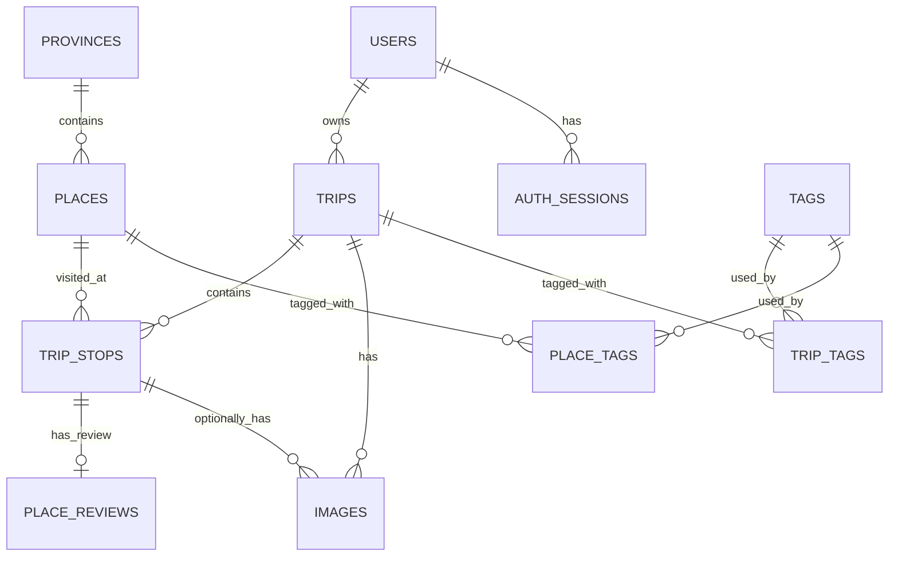

# AGENTS.md

## Project Overview

**Project name:** Nomad Diary

Nomad Diary is a personal travel diary application used to store:

- Authentication sessions
- Trips
- Stops within each trip
- Reusable places
- Provinces and cities
- Photos
- Personal reviews
- Favorite places
- Recommendations about whether a place should be visited again
- Tags
- Travel statistics
- A map that highlights visited provinces

The primary purpose is not to build a public social network. The application should first work well as a personal travel journal.

---

## Main Domain Model

```text
User
├── Auth Sessions
└── Trips
    ├── Trip Stops
    │   ├── Place
    │   │   └── Province
    │   ├── Place Review
    │   └── Images
    ├── Images
    └── Tags
```

### Core concepts

#### Auth Session

One login or refresh-token session for a user. A user may have multiple active
sessions for different devices. Store only a hash of the refresh token, never
the raw token. Logout, password changes, account deletion, and refresh-token
rotation revoke sessions through `revoked_at`.

#### Trip

A journey created by a user.

Examples:

- Đà Lạt mùa mưa 2024
- Hà Giang mùa tam giác mạch
- Phú Quốc nghỉ dưỡng

A trip contains multiple stops.

#### Place

A reusable physical location.

Examples:

- Hồ Xuân Hương
- Đồi chè Cầu Đất
- Cầu Rồng
- Đèo Mã Pí Lèng

A place should exist only once in the `places` table, even when it is visited in multiple trips.

#### Trip Stop

A specific visit to a place during a trip.

Example:

```text
Place: Hồ Xuân Hương

Trip A:
- visited on 2024-07-12

Trip B:
- visited again on 2026-03-08
```

These are two different `trip_stops` referencing the same `place`.

A trip may also visit the same place more than once. Do not add a unique constraint on `(trip_id, place_id)`.

#### Province

A normalized province or municipality.

A place belongs to a province.

Province codes are used to join database data with GeoJSON map features:

```text
provinces.code
↕
GeoJSON feature.properties.code
```

This allows the frontend to color an entire province after the user has visited at least one place in it.

#### Place Review

A personal review of one specific visit.

A review may contain:

- Rating from 1 to 5
- Favorite status
- Revisit status
- Notes
- Warning notes

Revisit status values:

```text
0 = not reviewed
1 = recommended
2 = consider
3 = not recommended
```

The latest review should be used when warning the user while planning a new trip.

Example warning:

```text
You have visited this place 2 times.
Latest rating: 2/5.
Status: Not recommended.
Note: Too crowded and difficult to park.
```

Warnings should not block the user from adding the place.

#### Image

An image always belongs to a trip.

An image may optionally belong to a trip stop.

```text
trip_id       required
trip_stop_id  optional
```

Examples:

- A trip cover image can belong only to the trip.
- A photo taken at Hồ Xuân Hương belongs to the corresponding trip stop.

Images can be filtered by:

- Trip
- Trip stop
- Place
- Province
- Capture date
- Favorite status

---

## Database

Database engine:

```text
PostgreSQL
```

Default schema:

```text
nomad_diary
```

Main tables:

```text
users
auth_sessions
provinces
places
trips
trip_stops
place_reviews
images
tags
trip_tags
place_tags
```

### Relationships



---

## Important Data Rules

### Users

- Username must be unique among active users.
- Email must be unique among active users.
- Password hashes must never be returned by public APIs.
- Seed passwords are only dummy values and must not be used in production.

### Auth Sessions

- An auth session belongs to one user.
- A user may have multiple sessions for different devices.
- Store only `refresh_token_hash`; never store or log the raw refresh token.
- Active sessions require `revoked_at IS NULL` and `expires_at > now()`.
- Refresh-token rotation revokes the old session and creates a new session in one transaction.
- Logout revokes the current session; password changes and account deletion revoke every session for the user.
- Hard-deleting a user cascades to their auth sessions.

### Trips

Trip status values:

```text
0 = draft
1 = planned
2 = ongoing
3 = completed
4 = cancelled
```

Rules:

- A trip belongs to one user.
- Slug must be unique per active user.
- `end_date` cannot be earlier than `start_date`.
- Soft-deleted trips must not appear in normal queries.

### Places

Rules:

- A place belongs to one province.
- Coordinates must be valid.
- Latitude must be between `-90` and `90`.
- Longitude must be between `-180` and `180`.
- A place must be reused when visited again.
- Do not duplicate a place for each trip.

### Trip Stops

Rules:

- A trip stop belongs to one trip and one place.
- `visit_order` starts at 1.
- Active `visit_order` values must be unique within a trip.
- The same place may appear multiple times in the same trip.
- `departed_at` cannot be earlier than `arrived_at`.

### Place Reviews

Rules:

- One active review per trip stop.
- Rating may be null or from 1 to 5.
- Revisit status must be from 0 to 3.
- The latest review is used when planning future trips.
- Do not copy the latest review into the `places` table.

### Images

Rules:

- `trip_id` is required.
- `trip_stop_id` is optional.
- When `trip_stop_id` is provided, the stop must belong to the same trip.
- Do not duplicate `place_id` or `province_id` in the images table.
- Place and province are derived through joins.
- Only one active cover image is allowed per trip.

### Tags

Tags can be attached to:

- Trips through `trip_tags`
- Places through `place_tags`

Do not store comma-separated tags in a text column.

---

## Soft Delete

Most main tables use:

```sql
is_deleted boolean NOT NULL DEFAULT false
```

Normal application queries must include:

```sql
is_deleted = false
```

Do not physically delete records unless cleanup is explicitly required.

Partial unique indexes may allow reuse of slugs after soft deletion.

---

## Map Behavior

The application uses province-level GeoJSON.

Recommended MVP approach:

```text
Database:
provinces(id, code, name, slug)

Frontend:
public/maps/vietnam-provinces.geojson
```

The frontend should:

1. Load the GeoJSON file.
2. Fetch visited province codes from the API.
3. Match `province.code` to `feature.properties.code`.
4. Color visited provinces.
5. Keep unvisited provinces gray.

Visited province query path:

```text
trips
→ trip_stops
→ places
→ provinces
```

A province is considered visited when the user has at least one active trip stop at an active place in that province.

---

## Recommended API Routes

### Authentication

```text
POST /api/auth/register
POST /api/auth/login
POST /api/auth/logout
POST /api/auth/refresh-token
GET  /api/auth/me
PATCH /api/auth/me
PATCH /api/auth/change-password
DELETE /api/auth/account
```

### Trips

```text
GET    /api/trips
POST   /api/trips
GET    /api/trips/:id
PATCH  /api/trips/:id
DELETE /api/trips/:id
```

### Trip Stops

```text
GET    /api/trips/:tripId/stops
POST   /api/trips/:tripId/stops
PATCH  /api/trip-stops/:id
DELETE /api/trip-stops/:id
PATCH  /api/trips/:tripId/stops/reorder
```

### Places

```text
GET    /api/places
POST   /api/places
GET    /api/places/:id
PATCH  /api/places/:id
GET    /api/places/:id/history
GET    /api/places/:id/planning-warning
```

### Provinces

```text
GET /api/provinces
GET /api/provinces/visited
GET /api/provinces/:id
GET /api/provinces/:id/places
```

### Reviews

```text
GET    /api/trip-stops/:tripStopId/review
PUT    /api/trip-stops/:tripStopId/review
DELETE /api/trip-stops/:tripStopId/review
```

### Images

```text
GET    /api/images
POST   /api/images
GET    /api/images/:id
PATCH  /api/images/:id
DELETE /api/images/:id
```

Supported image filters:

```text
GET /api/images?tripId=1
GET /api/images?tripStopId=10
GET /api/images?placeId=3
GET /api/images?provinceId=68
GET /api/images?favorite=true
GET /api/images?from=2026-01-01&to=2026-12-31
```

### Tags

```text
GET    /api/tags
POST   /api/tags
PATCH  /api/tags/:id
DELETE /api/tags/:id
```

---

## Query Guidance

### Count unique places versus visits

These are different statistics:

```sql
COUNT(DISTINCT trip_stops.place_id)
```

means unique places visited.

```sql
COUNT(trip_stops.id)
```

means total visits.

Example:

```text
Hồ Xuân Hương visited 3 times

Unique places: 1
Visits: 3
```

### Filter images by trip

Use:

```text
images.trip_id
```

### Filter images by place

Join:

```text
images
→ trip_stops
→ places
```

### Filter images by province

Join:

```text
images
→ trip_stops
→ places
→ provinces
```

### Latest review for planning warnings

Order by:

```sql
trip_stops.arrived_at DESC NULLS LAST,
trip_stops.id DESC
```

Use the most recent active review.

---

## Statistics Supported

The current model can calculate:

- Total trips
- Total unique places
- Total visits
- Total provinces visited
- Total images
- Trips per year
- Places visited per year
- First visit to each place
- Latest visit to each place
- Visit count per place
- Trip count per province
- Place count per province
- Image count per trip
- Image count per place
- Image count per province
- Favorite places
- Recommended places
- Places to consider
- Places not recommended
- Average rating by place
- Average rating by province
- Most revisited places
- New places versus revisits
- Latest trip
- Latest visited place

Do not claim support for these unless extra tables are added:

- Expenses
- Transportation segments
- Trip members
- Accommodation nights
- Actual travel distance
- Weather history

---

## Seed Data

Seed file:

```text
nomad-diary-seed.sql
```

The seed currently contains:

- 1 user
- 0 auth sessions (sessions are created at runtime by authentication flows)
- 6 trips
- 10 provinces
- 24 places
- 24 trip stops
- 21 reviews
- 64 images
- 10 tags

It includes:

- Places revisited across different trips
- A place visited multiple times in the same trip
- Recommended places
- Places to consider
- Places marked not recommended
- Favorite places
- Trip-level images
- Trip-stop images
- One planned trip without reviews or photos

Warning:

```sql
TRUNCATE ... RESTART IDENTITY CASCADE;
```

The seed file deletes existing data in the related tables before inserting dummy data.

---

## Development Priorities

### MVP

Implement in this order:

1. User authentication
2. Trip CRUD
3. Place CRUD
4. Province list
5. Trip stop CRUD
6. Trip stop ordering
7. Map markers
8. Province coloring
9. Place reviews
10. Planning warnings
11. Image upload and gallery
12. Image filters
13. Dashboard statistics
14. Tags

### Future Features

Possible later additions:

- PostGIS for point-in-polygon queries
- Import GPS metadata from images
- Route distance calculation
- Expense tracking
- Accommodation tracking
- Travel companions
- Weather snapshots
- Public travel stories
- AI image tagging
- Face clustering

Do not implement future features unless explicitly requested.

---

## Coding Rules

- Prefer simple, readable code.
- Do not introduce microservices for the MVP.
- Use a modular monolith.
- Keep database access in repository or service layers.
- Validate all identifiers and request bodies.
- Use parameterized SQL queries.
- Never build SQL by concatenating untrusted input.
- Never store, return, or log raw refresh tokens or password hashes.
- Revoke and rotate auth sessions transactionally.
- Always filter by the authenticated user's ownership.
- Do not expose another user's private trips.
- Do not return soft-deleted rows.
- Use transactions for operations that update multiple related tables.
- Use UTC or PostgreSQL `timestamptz` consistently.
- Avoid storing derived data unless performance requires it.
- Do not duplicate province, place, or trip fields into unrelated tables.
- Preserve historical reviews rather than overwriting place-level data.
- Prefer pagination for image and trip lists.

---

## Suggested Project Structure

```text
nomad-diary/
├── web/
│   ├── src/
│   │   ├── api/
│   │   ├── components/
│   │   ├── layouts/
│   │   ├── router/
│   │   ├── stores/
│   │   └── views/
│   └── public/
│       └── maps/
│           └── vietnam-provinces.geojson
├── api/
│   ├── src/
│   │   ├── modules/
│   │   │   ├── auth/
│   │   │   ├── trips/
│   │   │   ├── trip-stops/
│   │   │   ├── places/
│   │   │   ├── provinces/
│   │   │   ├── reviews/
│   │   │   ├── images/
│   │   │   ├── tags/
│   │   │   └── statistics/
│   │   ├── database/
│   │   ├── middleware/
│   │   └── shared/
│   └── tests/
├── database/
│   ├── nomad-diary.sql
│   ├── nomad-diary-seed.sql
│   └── migrations/
│       └── 001_auth_sessions.sql
├── AGENTS.md
└── README.md
```

---

## AI Agent Checklist

Before modifying code or the database, confirm:

- Are refresh tokens stored only as hashes and rotated transactionally?
- Do logout, password changes, and account deletion revoke the correct sessions?
- Is this a reusable place or a specific visit?
- Does the change preserve multiple visits to the same place?
- Does the query filter by the authenticated user?
- Does the query exclude soft-deleted rows?
- Does the change preserve image filtering by trip, place, and province?
- Does the change preserve province coloring on the map?
- Does the change preserve review history?
- Does the planning warning use the latest review?
- Are timestamps stored as `timestamptz`?
- Are all SQL inputs parameterized?
- Is the feature part of the MVP or an unnecessary future addition?
