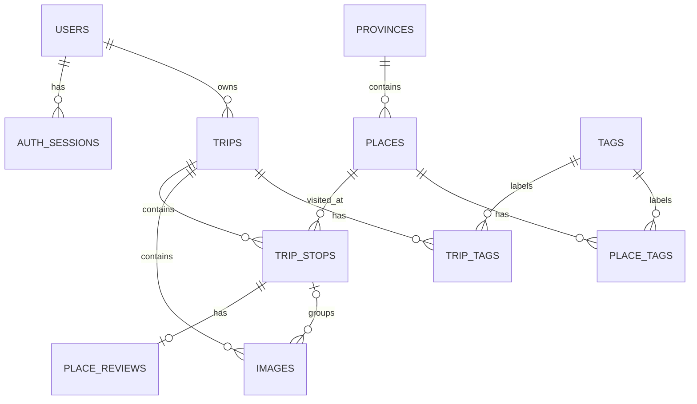

# Nomad Diary Database

Thiết kế PostgreSQL cho tài khoản, phiên đăng nhập, chuyến đi, lần ghé, địa
điểm, ảnh, review và tag của Nomad Diary. Tất cả object ứng dụng nằm trong
schema `nomad_diary`.

## Vai trò và phạm vi

- Schema đầy đủ để dựng database mới cho local/test.
- Migration tăng dần cho database đã có dữ liệu.
- Seed minh họa cho development/test.
- ERD Mermaid và quy tắc toàn vẹn dữ liệu.
- Hướng dẫn kết nối/vận hành PostgreSQL trên Amazon RDS.

## Cấu trúc thư mục

```text
database/
├── migrations/
│   └── 20260814_store_trip_locations.sql
├── AWS.md                    # Kết nối và migration trên Amazon RDS
├── nomad-diary-er.mmd        # ERD đầy đủ
├── nomad-diary-seed.sql      # Dữ liệu mẫu, có truncate
├── nomad-diary.sql           # Schema đầy đủ, có drop schema
└── README.md
```

## Yêu cầu

- PostgreSQL 14+.
- `psql`.
- Role có quyền tạo schema, table, function, trigger và index.
- Quyền kết nối SSL/chứng chỉ phù hợp nếu dùng RDS.

## Khởi tạo database local

Từ thư mục gốc repository:

```bash
createdb -U <user> <database>
psql -v ON_ERROR_STOP=1 -U <user> -d <database> -f database/nomad-diary.sql
```

`nomad-diary.sql` chạy trong transaction, đặt `search_path` thành
`nomad_diary, public` và dựng toàn bộ table/constraint/index/trigger.

> Cảnh báo: script có `DROP SCHEMA nomad_diary CASCADE`. Chạy lại sẽ xóa toàn
> bộ dữ liệu Nomad Diary trong database.

## Migration

Database đã có dữ liệu không được chạy lại schema đầy đủ. Chạy migration chưa
áp dụng theo thứ tự tên file:

```bash
psql -v ON_ERROR_STOP=1 -U <user> -d <database> \
  -f database/migrations/20260814_store_trip_locations.sql
```

Migration `20260814_store_trip_locations.sql`:

- thêm `places.ward_code` và `places.catalog_place_id`;
- cho phép tọa độ địa điểm là `NULL`;
- unique catalog place theo `catalog_place_id`;
- unique place nhập thủ công theo province, ward và slug;
- thêm index tra cứu province/ward.

Trước production migration:

1. Tạo snapshot/backup.
2. Xác nhận đúng host, database và user.
3. Kiểm tra migration chưa được áp dụng.
4. Dùng `ON_ERROR_STOP=1`.
5. Kiểm tra schema/index và log sau khi commit.

Hướng dẫn RDS đầy đủ: [AWS.md](AWS.md).

## Seed development/test

Sau khi dựng schema:

```bash
psql -v ON_ERROR_STOP=1 -U <user> -d <database> \
  -f database/nomad-diary-seed.sql
```

> Cảnh báo: seed dùng `TRUNCATE ... RESTART IDENTITY CASCADE`. Không chạy trên
> production hoặc database có dữ liệu cần giữ.

Seed minh họa user, province/place, trip, trip stop, review, tag và image. Auth
session không được seed vì được tạo bởi login/refresh runtime. Password hash và
S3 object key chỉ là dữ liệu mẫu.

## Mô hình dữ liệu



ERD kèm cột đầy đủ: [nomad-diary-er.mmd](nomad-diary-er.mmd).

| Bảng | Vai trò |
| --- | --- |
| `users` | Tài khoản và chủ sở hữu dữ liệu |
| `auth_sessions` | Session và SHA-256 hash của refresh token |
| `provinces` | Tỉnh/thành đã được lưu vào nhật ký |
| `places` | Địa điểm dùng lại giữa các lần ghé |
| `trips` | Chuyến đi của user |
| `trip_stops` | Một lần ghé place trong trip |
| `place_reviews` | Review cho một lần ghé |
| `images` | Metadata và object key ảnh |
| `tags` | Danh mục tag |
| `trip_tags` | Liên kết trip-tag |
| `place_tags` | Liên kết place-tag |

`place` và `trip_stop` khác nhau: một place được tái sử dụng, còn mỗi lần ghé
tạo một trip stop riêng, kể cả ghé lại cùng nơi trong cùng chuyến đi.

## Location Catalog và PostgreSQL

Frontend đọc tỉnh/phường/place từ Location Catalog DynamoDB. Khi user lưu trip
stop, backend trong cùng transaction:

1. tạo hoặc tái sử dụng province theo country/code;
2. tái sử dụng catalog place theo `catalog_place_id`, hoặc place thủ công theo
   province/ward/slug;
3. tạo trip stop trỏ tới place;
4. không cho payload mới ghi đè bản ghi dùng chung đã tồn tại.

Production không cần seed toàn bộ Location Catalog vào PostgreSQL. PostgreSQL
chỉ giữ dữ liệu đã đi vào nhật ký của người dùng.

## Quy tắc dữ liệu

- Bảng nghiệp vụ dùng soft delete qua `is_deleted`; query bình thường phải lọc
  bản ghi đã xóa.
- Username, email và tag name unique không phân biệt hoa/thường.
- Slug trip unique theo user; province unique theo country/code và country/slug.
- Catalog place active unique theo `catalog_place_id`.
- Place thủ công active unique theo province, ward và slug khi có ward code.
- `trip_stops.visit_order` lớn hơn 0 và unique trong trip active.
- Thời gian rời không được trước thời gian đến.
- Một trip stop có tối đa một review active; rating là `NULL` hoặc 1–5.
- Foreign key kép `(trip_stop_id, trip_id)` bảo đảm ảnh gắn đúng trip.
- Một trip có tối đa một cover image active.
- `images.ai_tags` dùng `jsonb` và GIN index.
- Trigger `set_updated_at()` cập nhật timestamp cho các bảng thực thể.

### Trạng thái trip

| Giá trị | Tên |
| ---: | --- |
| `0` | `draft` |
| `1` | `planned` |
| `2` | `ongoing` |
| `3` | `completed` |
| `4` | `cancelled` |

### Trạng thái quay lại

| Giá trị | Ý nghĩa |
| ---: | --- |
| `0` | Chưa xác định |
| `1` | Nên quay lại |
| `2` | Cân nhắc |
| `3` | Không nên quay lại |

## Lưu trữ ảnh

Database chỉ lưu S3 object key:

| Bảng.cột | Dữ liệu |
| --- | --- |
| `users.avatar_key` | Avatar |
| `trips.thumbnail_key` | Ảnh bìa trip |
| `images.image_key` | Ảnh gốc |
| `images.thumbnail_key` | Thumbnail tùy chọn |

Key có dạng:

```text
users/{userId}/{purpose}/{uuid}.{extension}
```

`purpose` là `avatar`, `trip-cover` hoặc `image`. Không lưu S3 URL,
CloudFront URL hoặc presigned URL trong database. Seed chỉ ghi key, không upload
object lên S3.

## Toàn vẹn tham chiếu

- Hard-delete user cascade auth session, trip và dữ liệu phụ thuộc.
- Không hard-delete province khi còn place hoặc place khi còn trip stop.
- Hard-delete trip stop cascade review và liên kết ảnh trực tiếp.
- Hard-delete tag xóa row liên kết tương ứng.
- Soft delete không tự cascade; application service phải xử lý ownership và lọc
  dữ liệu.

## Kiểm tra sau thay đổi

Trong `psql`:

```sql
SET search_path TO nomad_diary, public;

\dt
\d places

SELECT COUNT(*) FROM users;
```

Kiểm tra migration catalog:

```sql
SELECT column_name, data_type, is_nullable
FROM information_schema.columns
WHERE table_schema = 'nomad_diary'
  AND table_name = 'places'
  AND column_name IN ('ward_code', 'catalog_place_id', 'latitude', 'longitude')
ORDER BY column_name;
```

## Giới hạn hiện tại

- Chưa có migration runner hoặc bảng lịch sử migration tự động.
- Chưa có PostgreSQL RLS.
- Chưa có mô hình chi phí, chặng di chuyển, chỗ ở hoặc bạn đồng hành.
- Seed image chỉ có object key mẫu.

## Tài liệu liên quan

- [Tổng quan repository](../README.md)
- [Mục lục tài liệu](../docs/README.md)
- [PostgreSQL trên Amazon RDS](AWS.md)
- [Backend API](../back-end/README.md)
