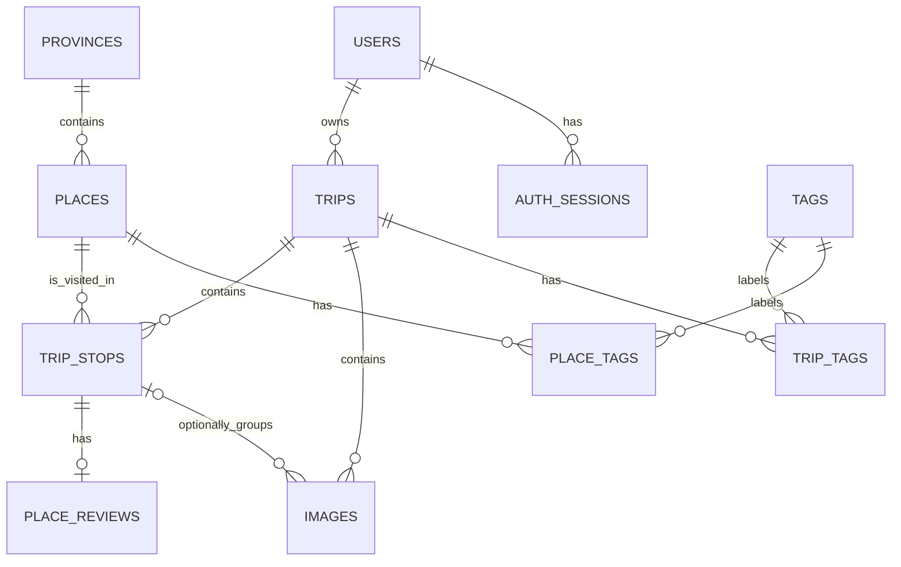

# Nomad Diary

Thiết kế cơ sở dữ liệu PostgreSQL cho **Nomad Diary** — một nhật ký du lịch cá nhân để lưu chuyến đi, các lần ghé địa điểm, ảnh, đánh giá và thống kê. Mô hình ưu tiên lịch sử cá nhân; đây không phải là thiết kế cho mạng xã hội công khai.

## Nội dung

```text
database/
├── nomad-diary.sql           # Schema, ràng buộc, chỉ mục và trigger
├── nomad-diary-seed.sql      # Dữ liệu mẫu cho môi trường development/test
├── migrations/               # Thay đổi tăng dần cho database đang có dữ liệu
└── nomad-diary-er.mmd        # ERD Mermaid đầy đủ
```

Schema được tạo trong namespace PostgreSQL `nomad_diary` (không phải tên database).

## Khởi tạo cơ sở dữ liệu

Cần một phiên bản PostgreSQL hỗ trợ identity columns, `jsonb` và GIN indexes. Role chạy lệnh cần quyền tạo schema, bảng, function và trigger.

```bash
createdb -U <user> <database>
psql -v ON_ERROR_STOP=1 -U <user> -d <database> -f database/nomad-diary.sql
```

Script schema tự mở transaction, đặt `search_path` thành `nomad_diary, public` và chỉ reset schema riêng `nomad_diary`. Có thể chạy lại script để dựng lại toàn bộ cấu trúc của ứng dụng mà không xóa các đối tượng khác trong schema `public`.

> **Cảnh báo:** mỗi lần chạy file schema, lệnh `DROP SCHEMA nomad_diary CASCADE` sẽ xóa toàn bộ bảng và dữ liệu Nomad Diary hiện có trước khi dựng lại cấu trúc.

Với database đang có dữ liệu, chạy từng migration mới theo thứ tự tên file thay vì chạy lại schema:

```bash
psql -v ON_ERROR_STOP=1 -U <user> -d <database> -f database/migrations/20260814_store_trip_locations.sql
```

Để nạp dữ liệu mẫu sau khi đã tạo schema:

```bash
psql -v ON_ERROR_STOP=1 -U <user> -d <database> -f database/nomad-diary-seed.sql
```

> **Cảnh báo:** seed chạy `TRUNCATE ... RESTART IDENTITY CASCADE` trên toàn bộ 11 bảng trước khi chèn dữ liệu. Chỉ dùng cho development/test; không dùng trên database có dữ liệu cần giữ lại. Hash mật khẩu và S3 object key trong seed đều là dữ liệu mẫu.

## Mô hình dữ liệu



ERD kèm danh sách cột đầy đủ: [nomad-diary-er.mmd](nomad-diary-er.mmd).

| Bảng            | Vai trò                                                               |
| --------------- | --------------------------------------------------------------------- |
| `users`         | Chủ sở hữu nhật ký và chuyến đi.                                      |
| `auth_sessions` | Phiên đăng nhập/refresh token của user; chỉ lưu hash refresh token.   |
| `provinces`     | Tỉnh/thành đã xuất hiện trong lịch sử trip; `code` lấy từ Location Catalog. |
| `places`        | Địa điểm đã được lưu trong trip, gồm mã/tên phường và địa chỉ.        |
| `trips`         | Một chuyến đi của một người dùng.                                     |
| `trip_stops`    | Một lần ghé một địa điểm trong một chuyến đi.                         |
| `place_reviews` | Đánh giá cá nhân cho một lần ghé cụ thể.                              |
| `images`        | Ảnh của chuyến đi, có thể gắn với một điểm dừng.                      |
| `tags`          | Danh mục tag dùng chung.                                              |
| `trip_tags`     | Liên kết nhiều-nhiều giữa chuyến đi và tag.                           |
| `place_tags`    | Liên kết nhiều-nhiều giữa địa điểm và tag.                            |

`places` và `trip_stops` là hai khái niệm khác nhau: một `place` chỉ được lưu một lần, còn mỗi lần ghé — kể cả ghé lại cùng địa điểm trong cùng một trip — tạo một `trip_stop` riêng.

Ở production không cần seed `provinces` hoặc `places`. Frontend đọc tỉnh, phường/xã và gợi ý địa điểm từ Location Catalog. Khi user lưu một trip stop, backend tạo tỉnh/địa điểm còn thiếu trong cùng transaction rồi liên kết `trip_stops.place_id`; bản ghi dùng chung đã tồn tại không bị payload client ghi đè. Địa điểm catalog được định danh bằng `catalog_place_id`, còn địa điểm tự nhập được tái sử dụng theo tên trong cùng phường/xã. Dữ liệu cũ chưa có `ward_code` vẫn được tra cứu theo tên phường hoặc tái sử dụng khi khớp một địa điểm catalog.

## Quy tắc dữ liệu chính

- Hầu hết bảng chính dùng soft delete qua `is_deleted`. Mọi truy vấn nghiệp vụ bình thường phải lọc `is_deleted = false`; các unique index cũng chỉ áp dụng với bản ghi còn hoạt động.
- Mỗi `auth_session` thuộc một user. Phiên chỉ còn hiệu lực khi chưa bị revoke và chưa hết hạn; database chỉ lưu hash của refresh token, không lưu token gốc.
- Username, email và tên tag được unique không phân biệt hoa/thường. Slug trip còn hoạt động là unique theo user, slug province theo quốc gia; địa điểm catalog unique toàn cục theo mã catalog, còn địa điểm tự nhập unique theo slug trong phường/xã. Tag slug là unique toàn cục.
- `trip_stops.visit_order` phải lớn hơn 0 và duy nhất trong một trip còn hoạt động. Thời điểm rời đi không được sớm hơn thời điểm đến.
- Mỗi `trip_stop` có tối đa một review còn hoạt động; rating là `NULL` hoặc từ 1 đến 5.
- Mỗi ảnh luôn thuộc một `trip`. Nếu có `trip_stop_id`, foreign key kép `(trip_stop_id, trip_id)` bảo đảm điểm dừng thuộc đúng chuyến đi đó. Một trip chỉ có tối đa một ảnh cover còn hoạt động.
- Tọa độ, ngày đi/về, kích thước ảnh và thứ tự ảnh đều có `CHECK` constraint. `images.ai_tags` dùng `jsonb` và có GIN index để phục vụ truy vấn tag AI.
- Trigger `set_updated_at()` tự cập nhật `updated_at` cho tám bảng thực thể chính.

### Lưu trữ ảnh trên S3

Database chỉ lưu **S3 object key**, không lưu URL S3 hoặc presigned URL:

| Bảng | Cột | Mục đích |
| --- | --- | --- |
| `users` | `avatar_key` | Key ảnh đại diện của user. |
| `trips` | `thumbnail_key` | Key ảnh bìa của chuyến đi. |
| `images` | `image_key` | Key ảnh gốc; bắt buộc. |
| `images` | `thumbnail_key` | Key ảnh thumbnail; có thể `NULL`. |

Key do API upload tạo theo cấu trúc:

```text
users/{userId}/{purpose}/{uuid}.{extension}
```

Trong đó `purpose` là `avatar`, `trip-cover` hoặc `image`. Ứng dụng dùng bucket cấu hình riêng kết hợp với key để tạo presigned URL khi cần upload hoặc đọc ảnh. Không lưu presigned URL vì URL này có thời hạn ngắn.

### Giá trị trạng thái

| `trips.status` | Ý nghĩa     |
| -------------: | ----------- |
|              0 | `draft`     |
|              1 | `planned`   |
|              2 | `ongoing`   |
|              3 | `completed` |
|              4 | `cancelled` |

| `place_reviews.revisit_status` | Ý nghĩa            |
| -----------------------------: | ------------------ |
|                              0 | Chưa xác định      |
|                              1 | Nên quay lại       |
|                              2 | Cân nhắc           |
|                              3 | Không nên quay lại |

## Toàn vẹn tham chiếu

- Xóa thật user sẽ cascade tới auth session, trip và các dữ liệu phụ thuộc của trip.
- Không thể xóa thật tỉnh/thành phố khi còn `places`; không thể xóa `place` khi còn `trip_stops` tham chiếu đến nó.
- Xóa `trip_stop` sẽ cascade review và ảnh gắn trực tiếp với điểm dừng; xóa tag sẽ xóa các liên kết tag tương ứng.
- Soft delete không tự cascade. Ứng dụng cần chủ động lọc bản ghi đã xóa và luôn kiểm tra quyền sở hữu trip theo người dùng đã xác thực.

## Dữ liệu mẫu

Seed hiện có một người dùng, 0 auth session, 6 chuyến đi, 10 tỉnh/thành phố, 24 địa điểm, 24 lần ghé, 21 review, 10 tag và 64 ảnh. Auth session không được seed vì được tạo bởi luồng đăng nhập/refresh token lúc chạy ứng dụng. Dữ liệu minh hoạ các trường hợp ghé lại địa điểm qua nhiều chuyến, ghé cùng một nơi nhiều lần trong một chuyến, ảnh cấp trip/stop và các trạng thái đánh giá khác nhau.

Các giá trị `avatar_key`, `thumbnail_key` và `image_key` trong seed là key mẫu theo đúng cấu trúc của upload API. Chạy seed chỉ ghi key vào PostgreSQL, **không upload object lên S3**. Muốn mở được ảnh seed, bucket phải có object với key trùng khớp; nếu không S3 sẽ trả `NoSuchKey`.

## Phạm vi hiện tại

Repository hiện chứa thiết kế database và backend API; chưa có ứng dụng web, Docker configuration hay chính sách phân quyền/RLS. Các tính năng như chi phí, chặng di chuyển, chỗ ở, bạn đồng hành và khoảng cách thực tế chưa thuộc mô hình hiện tại.
